# Especificações do Projeto

A definição exata do problema e os pontos mais relevantes a serem tratados neste projeto foi consolidada com a participação dos usuários em um trabalho de imersão feita pelos membros da equipe a partir da observação dos usuários em seu local natural. Os detalhes levantados nesse processo foram consolidados na forma de personas e histórias de usuários. 

## Personas

As personas levantadas durante o processo de entendimento do problema são apresentadas na Figuras que se seguem 

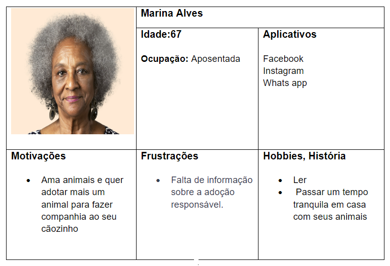  
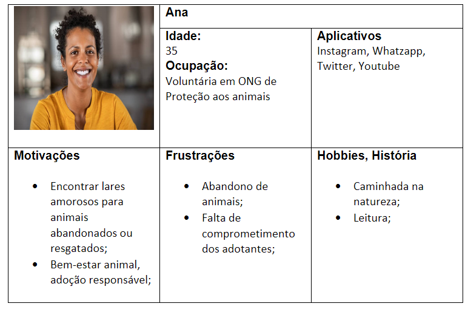  
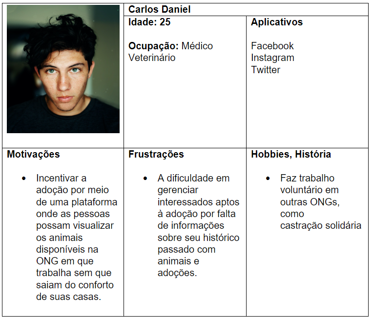  
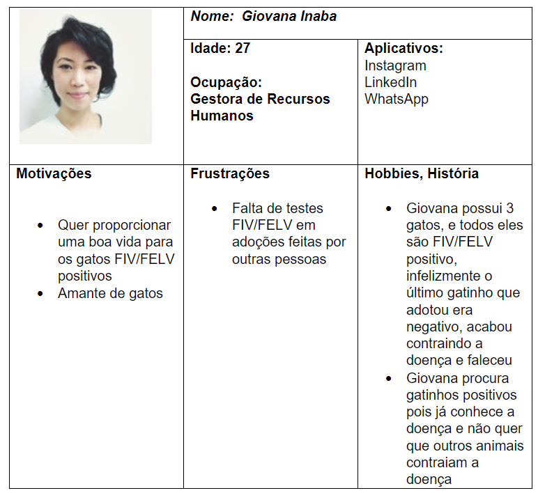   
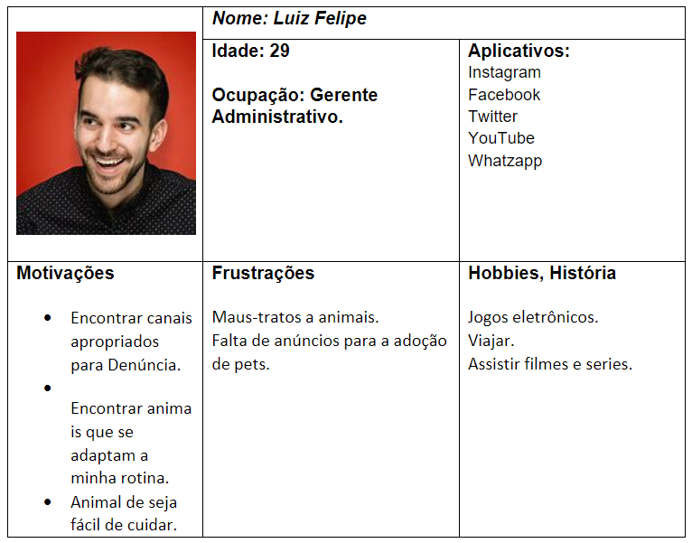  
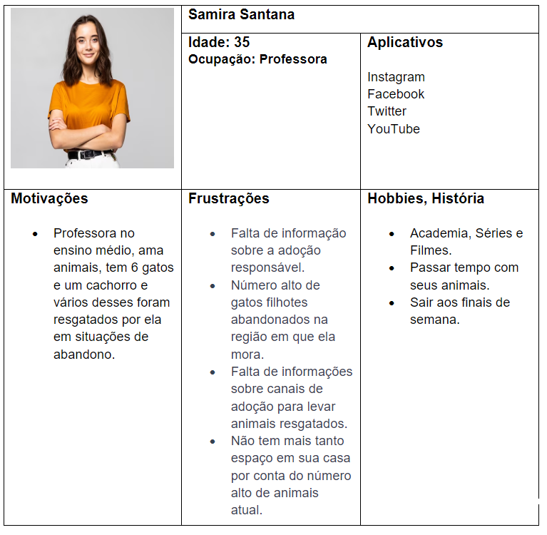   

## Histórias de Usuários

Com base na análise das personas foram identificadas as seguintes histórias de usuários:

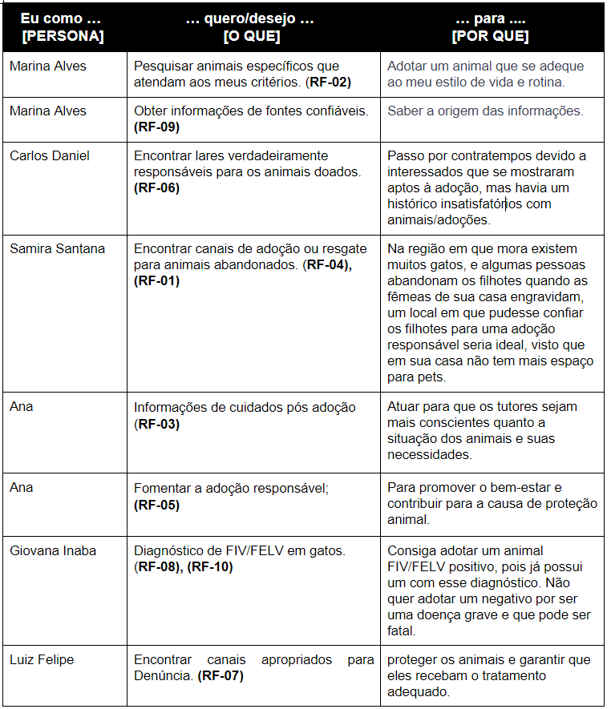 

## Requisitos

As tabelas que se seguem apresentam os requisitos funcionais e não funcionais que detalham o escopo do projeto.

### Requisitos Funcionais

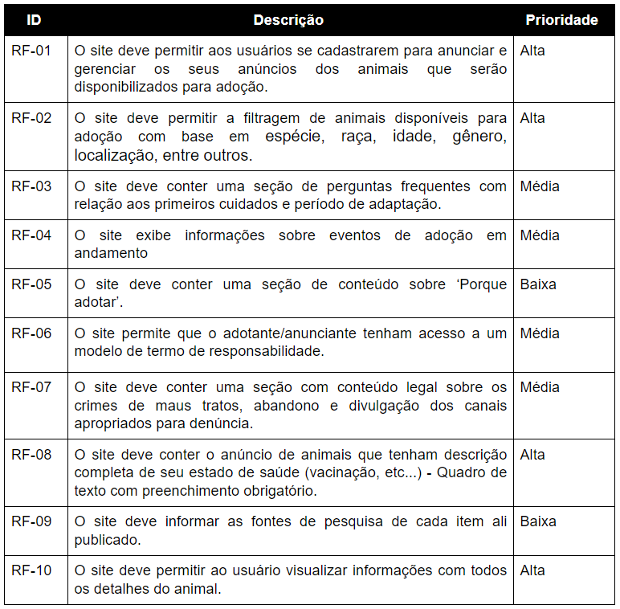 

### Requisitos não Funcionais

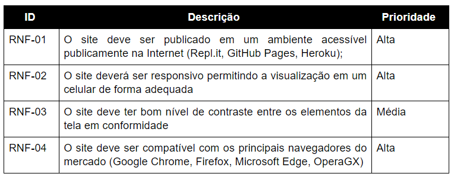 

## Restrições

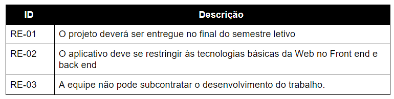 

## Diagrama de Casos de Uso

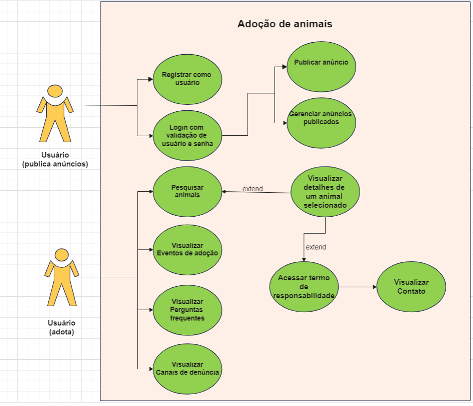

