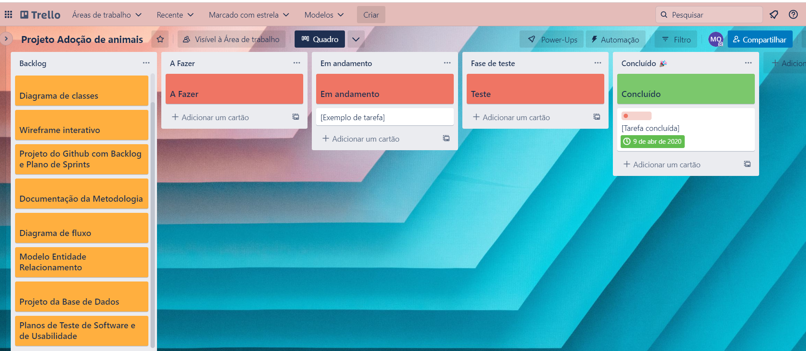

# Metodologia

A metodologia contempla as definições de ferramenta utilizado pela equipe tanto para a manutenção dos códigos e demais artefatos quanto para a organização do time na execução das tarefas do projeto. 

## Controle de Versão

A ferramenta de controle de versão adotada no projeto foi o
[Git](https://git-scm.com/), sendo que o [Github](https://github.com)
foi utilizado para hospedagem do repositório.

O projeto segue a seguinte convenção para o nome de branches:

- `main`: versão estável já testada do software
- `unstable`: versão já testada do software, porém instável
- `testing`: versão em testes do software
- `dev`: versão de desenvolvimento do software

## Gerenciamento de Projeto

### Divisão de Papéis

A equipe utiliza metodologias ágeis, tendo escolhido o Scrum como base para definição do processo de desenvolvimento. 
A equipe está organizada da seguinte maneira: 

* **Scrum master**: Mirian Oliveira
* **Product Owner**: Iris Gabriela
* **Equipe de Desenvolvimento**:
>Arthur Barbosa 
>Brendon Oliveira 
>Enrico Menicucci 
>Gustavo De Abreu  

### Processo

Para organização e distribuição das tarefas do projeto, a equipe está utilizando o Trello estruturado com as seguintes listas:  
 
* **Backlog**: recebe as tarefas a serem trabalhadas e representa o Product Backlog. Todas as atividades identificadas no decorrer do projeto também devem ser incorporadas a esta lista. 
* **A fazer**: Esta lista representa o Sprint Backlog. Este é o Sprint atual que estamos trabalhando.
* **Em andamento**: Quando uma tarefa tiver sido iniciada, ela é movida para cá. 
* **Em fase de teste**: Checagem de Qualidade. Quando as tarefas são concluídas, elas são movidas para o “CQ”. No final da semana, revemos essa lista para garantir que tudo saiu perfeito. 
* **Concluído**: nesta lista são colocadas as tarefas que passaram pelos testes e controle de qualidade e estão prontos para ser entregues ao usuário. Não há mais edições ou revisões necessárias, ele está agendado e pronto para a ação. 

O quadro kanban do grupo no Trello está disponível através da URL [https://trello.com/b/p4ksokhj/projeto-ado%C3%A7%C3%A3o-de-animais] e é apresentado abaixo:

### Ferramentas

Os artefatos do projeto são desenvolvidos a partir de diversas plataformas e a relação dos ambientes com seu respectivo propósito é apresentada abaixo.  

* **Repositório de código fonte**: [Github](https://github.com/ICEI-PUC-Minas-PMV-ADS/pmv-ads-2023-1-e2-proj-int-t4-pmv-ads-2023-1-e2-proj-int-t4-g5-adocao)
* **Documentos do projeto**: [One Drive](https://sgapucminasbr-my.sharepoint.com/:w:/r/personal/1402443_sga_pucminas_br/_layouts/15/Doc.aspx?sourcedoc=%7B8F678682-54E8-4BD1-A63C-4B18A52513AB%7D&file=Projeto%20Ado%C3%A7%C3%A3o%20de%20animais.docx&action=default&mobileredirect=true&DefaultItemOpen=1&login_hint=1402443%40sga.pucminas.br&ct=1680568613974&wdOrigin=OFFICECOM-WEB.MAIN.REC&cid=174d8939-f2f3-4717-9dca-abd1a213c186)
* **Projeto de Interface e  Wireframes**: [Figma](https://www.figma.com/file/a3eYU6a6JoysTJQObRdvpU/Projeto-Ado%C3%A7%C3%A3o-de-Animais?node-id=0-1)
* **Gerenciamento do Projeto**: [Trello](https://trello.com/b/p4ksokhj/projeto-ado%C3%A7%C3%A3o-de-animais)

A documentação se encontra no Github, ferramente de fácil acesso à toda equipe. A ferramenta de comunicação utilizada permite a equipe verificar quais etapas foram concluidas e quais precisam fazer, além de permitir verificar se a equipe está se desenvolvendo de forma conjunta. Por fim, para criar diagramas utilizamos essa ferramenta por melhor captar as necessidades da nossa solução.
