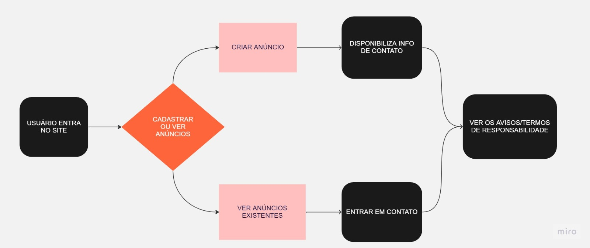
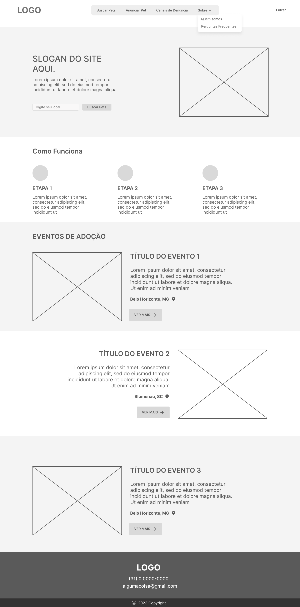
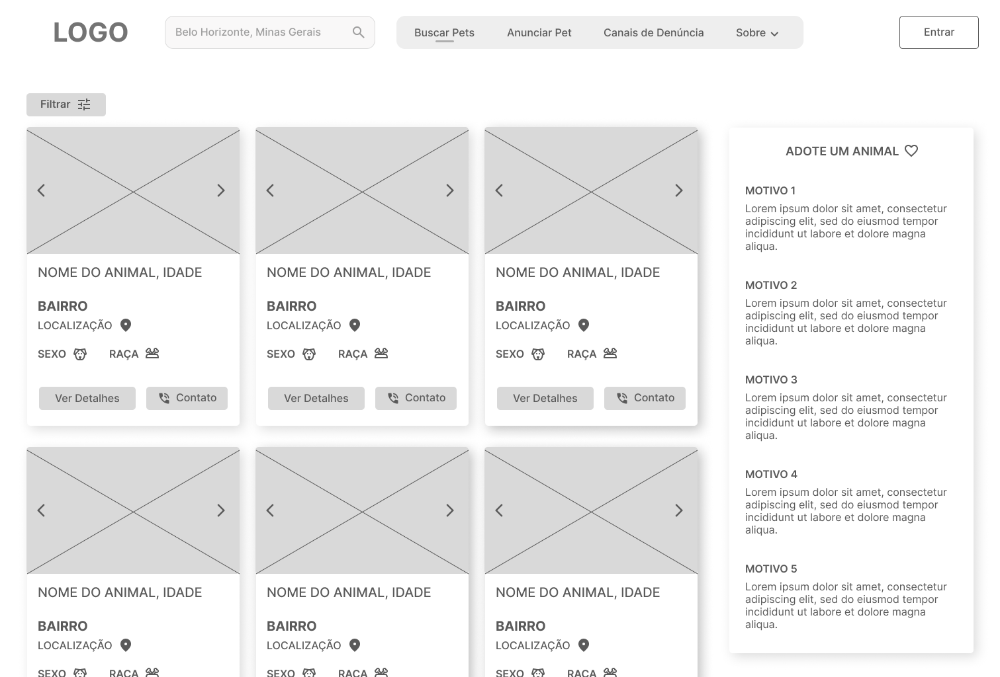
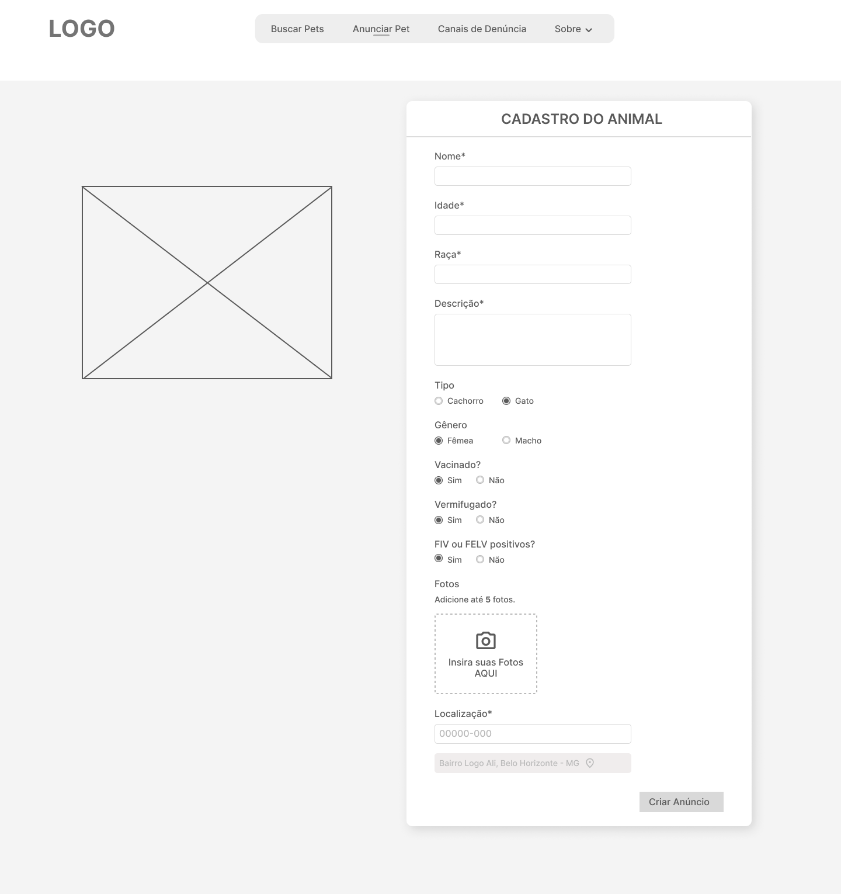
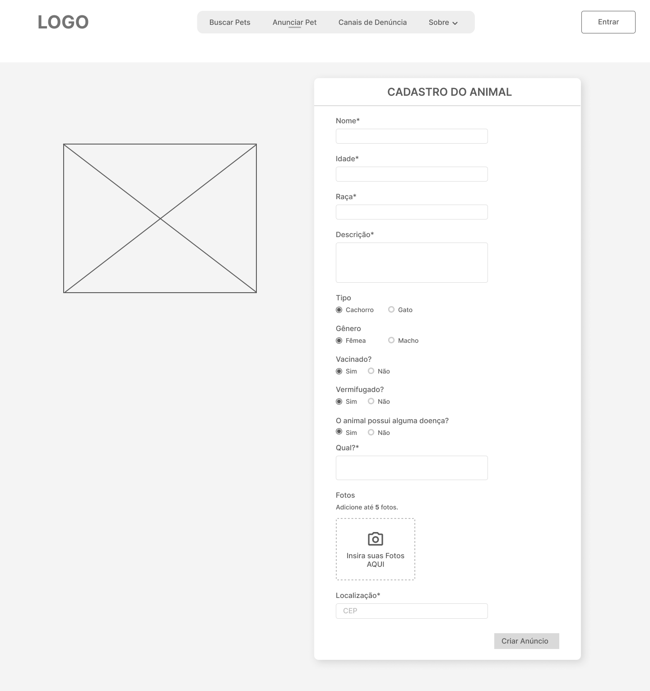
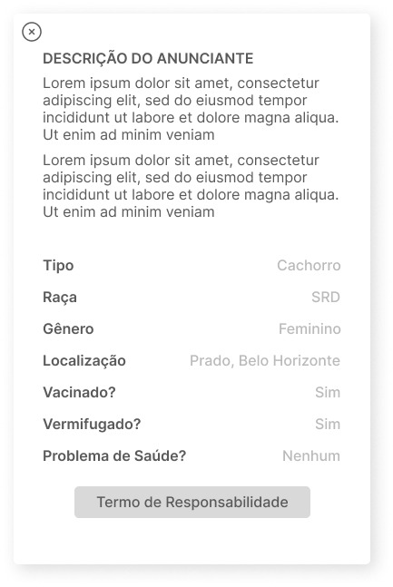
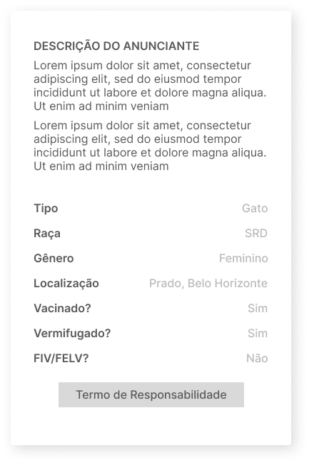
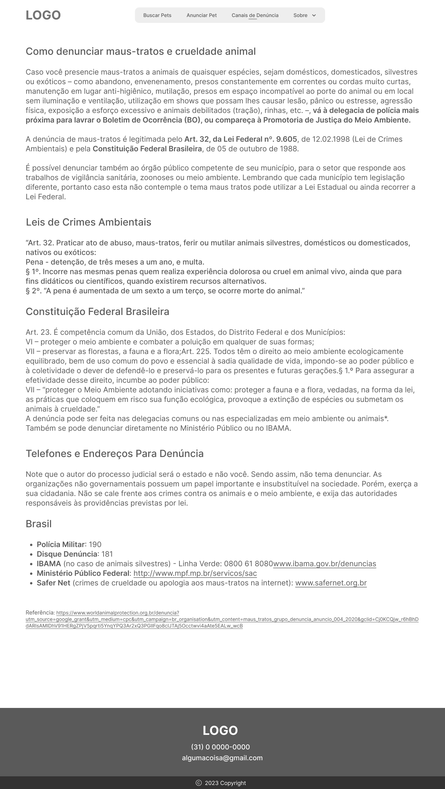
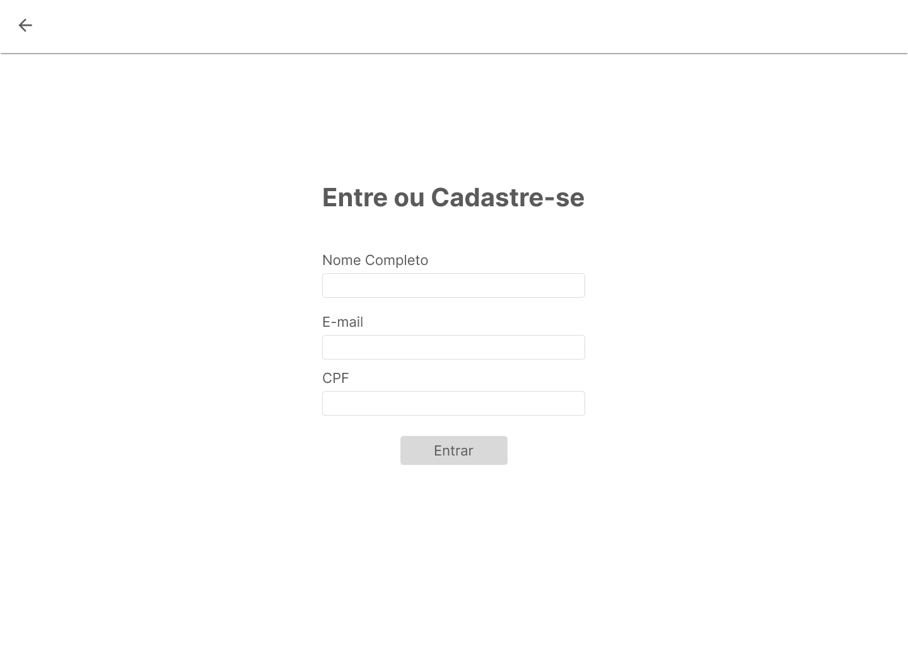

# Projeto de Interface

Visão geral da interação do usuário pelas telas do sistema e protótipo interativo das telas com as funcionalidades que fazem parte do sistema (wireframes).

## Diagrama de Fluxo

O diagrama apresenta o estudo do fluxo de interação do usuário com o sistema interativo e  muitas vezes sem a necessidade do desenho do design das telas da interface. Isso permite que o design das interações seja bem planejado e gere impacto na qualidade no design do wireframe interativo que será desenvolvido logo em seguida.

Veja o exemplo de estrutura básica de um diagrama de fluxo centrado nas ações dos usuários: 
  

## Wireframes

Conforme o diagrama de fluxo do projeto, apresentado no item anterior, as telas do sistema são apresentadas em detalhes nos itens que se seguem. Para visualizar o wireframe interativo, acesse o [ambiente Figma do projeto](https://www.figma.com/file/a3eYU6a6JoysTJQObRdvpU/Projeto-Ado%C3%A7%C3%A3o-de-Animais?t=CwkApcX7naFhrjcU-0).
 
### Tela - Home-Page

A home page traz no cabeçalho a logo e 5 componentes: "Buscar pets", "Anunciar pets", "Canais de denuncia" e  "Sobre". Abaixo do cabeçalho, vemos também o slogan do site e uma breve explicação de como funciona a aplicação.Por último uma seção de eventos de adoção.

### Tela - Quem somos

A tela "Quem somos" apresenta ao usuário uma breve explicação sobre a organização e a visão geral do serviço oferecido pelo site.

### Tela - Perguntas frequentes

A tela "Perguntas frequentes" traz respostas à perguntas comuns que os visitantes do site possam ter sobre adoção de animais.

### Tela - Anúncio|Busca de pets

A tela "Anúncio|Busca de pets" permite que os usuários encontrem animais com base em critérios específicos. A seção de busca permite que o usuário digite uma palavra-chave e procure animais relacionados.

### Tela - Cadastro de animal: Gato

A tela "Cadastro de animal: Gato" permite que os usuários anunciem um gato, disponibilizando-o para adoção.

### Tela - Cadastro de animal: Cachorro

A tela "Cadastro de animal: Cachorro" permite que os usuários anunciem um cachorro, disponibilizando-o para adoção.

### Tela- Descrição

Esta tela permite ao usuário ver a descrição completa do animal. Esta tela é exibida na forma de uma janela modal. 

### Tela- Contato

Esta tela permite ao usuário visualizar os contatos do anunciante. Esta tela é exibida na forma de uma janela modal. 

### Tela- Filtros

Esta tela permite que os usuários encontrem animais com base em critérios específicos.Esta tela é exibida na forma de uma janela modal. 

### Tela- Canais de Denúncia

Esta tela fornece aos usuários informações e orientações sobre como denunciar maus-tratos ou abandono de animais. 

### Tela- Login

Esta tela permite ao usuário autenticar a sua identidade.

